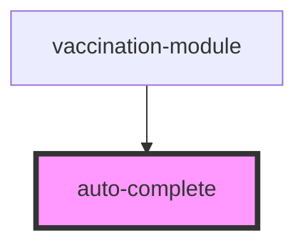

# auto-complete

<!-- Auto Generated Below -->

## Properties

| Property          | Attribute         | Description | Type     | Default     |
| ----------------- | ----------------- | ----------- | -------- | ----------- |
| `environment`     | `environment`     |             | `string` | `''`        |
| `filterKey`       | `filter-key`      |             | `string` | `''`        |
| `language`        | `language`        |             | `string` | `undefined` |
| `placeholder`     | `placeholder`     |             | `string` | `''`        |
| `token_api_nimbo` | `token_api_nimbo` |             | `string` | `''`        |

## Events

| Event                     | Description | Type               |
| ------------------------- | ----------- | ------------------ |
| `itemSelected`            |             | `CustomEvent<any>` |
| `itemSelectedAddManually` |             | `CustomEvent<any>` |

## Dependencies

### Used by

 - [vaccination-module](../vaccination-module)

### Graph

----------------------------------------------

*Built with [StencilJS](https://stenciljs.com/)*
