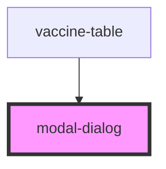

# modal-dialog

<!-- Auto Generated Below -->

## Properties

| Property    | Attribute    | Description | Type      | Default     |
| ----------- | ------------ | ----------- | --------- | ----------- |
| `language`  | `language`   |             | `string`  | `undefined` |
| `showModal` | `show-modal` |             | `boolean` | `false`     |

## Events

| Event                | Description | Type               |
| -------------------- | ----------- | ------------------ |
| `confirmationDelete` |             | `CustomEvent<any>` |

## Dependencies

### Used by

 - [vaccine-table](../vaccine-table)

### Graph

----------------------------------------------

*Built with [StencilJS](https://stenciljs.com/)*
