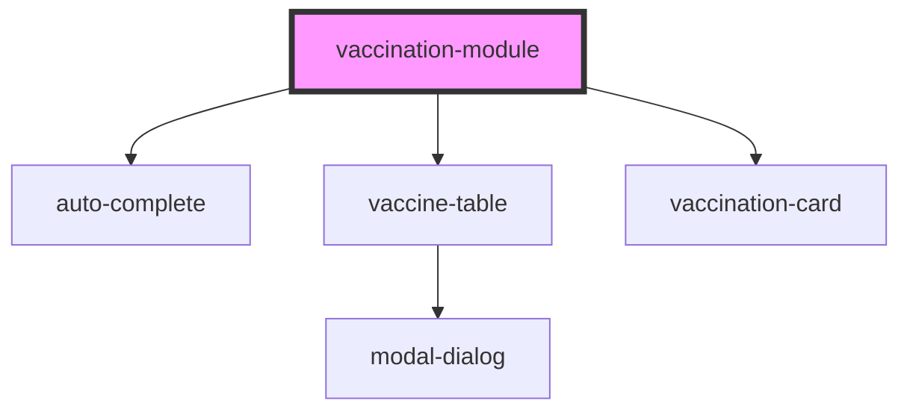

# my-component

<!-- Auto Generated Below -->

## Properties

| Property          | Attribute         | Description | Type      | Default     |
| ----------------- | ----------------- | ----------- | --------- | ----------- |
| `environment`     | `environment`     |             | `string`  | `undefined` |
| `language`        | `language`        |             | `string`  | `undefined` |
| `person_id`       | `person_id`       |             | `number`  | `undefined` |
| `show_print`      | `show_print`      |             | `boolean` | `false`     |
| `token_api_nimbo` | `token_api_nimbo` |             | `string`  | `undefined` |

## Dependencies

### Depends on

- [auto-complete](../auto-complete)
- [vaccine-table](../vaccine-table)
- [vaccination-card](../vaccination-card)

### Graph

----------------------------------------------

*Built with [StencilJS](https://stenciljs.com/)*
