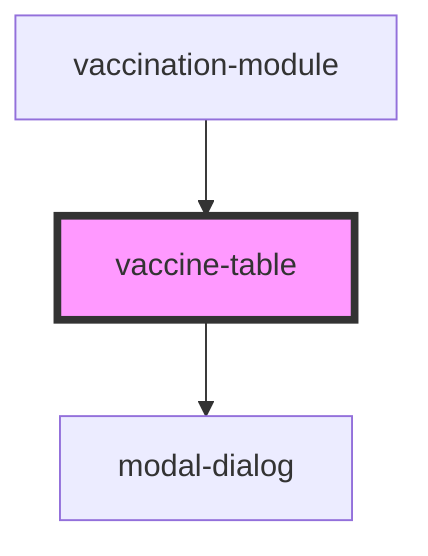

# vaccine-table

<!-- Auto Generated Below -->

## Properties

| Property          | Attribute         | Description | Type                   | Default     |
| ----------------- | ----------------- | ----------- | ---------------------- | ----------- |
| `environment`     | `environment`     |             | `string`               | `undefined` |
| `language`        | `language`        |             | `string`               | `undefined` |
| `token_api_nimbo` | `token_api_nimbo` |             | `string`               | `undefined` |
| `vaccines`        | --                |             | `VaccineApplication[]` | `[]`        |

## Events

| Event            | Description | Type               |
| ---------------- | ----------- | ------------------ |
| `vaccineDeleted` |             | `CustomEvent<any>` |
| `vaccineEdit`    |             | `CustomEvent<any>` |
| `vaccineSave`    |             | `CustomEvent<any>` |

## Dependencies

### Used by

 - [vaccination-module](../vaccination-module)

### Depends on

- [modal-dialog](../modal-dialog)

### Graph

----------------------------------------------

*Built with [StencilJS](https://stenciljs.com/)*
