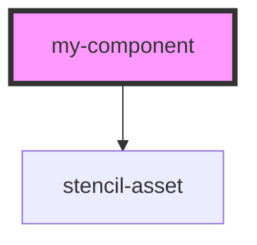

# my-component

<!-- Auto Generated Below -->

## Properties

| Property                      | Attribute                     | Description | Type     | Default     |
| ----------------------------- | ----------------------------- | ----------- | -------- | ----------- |
| `environment`                 | `environment`                 |             | `string` | `undefined` |
| `token_api_nimbo_vital_signs` | `token_api_nimbo_vital_signs` |             | `string` | `undefined` |
| `vital_signs_account_id`      | `vital_signs_account_id`      |             | `number` | `undefined` |
| `vital_signs_consultation_id` | `vital_signs_consultation_id` |             | `number` | `undefined` |
| `vital_signs_data`            | `vital_signs_data`            |             | `string` | `undefined` |
| `vital_signs_person_id`       | `vital_signs_person_id`       |             | `number` | `undefined` |
| `vital_signs_set_id`          | `vital_signs_set_id`          |             | `number` | `undefined` |

## Dependencies

### Depends on

- [stencil-asset](../stencil-asset)

### Graph

----------------------------------------------

*Built with [StencilJS](https://stenciljs.com/)*
